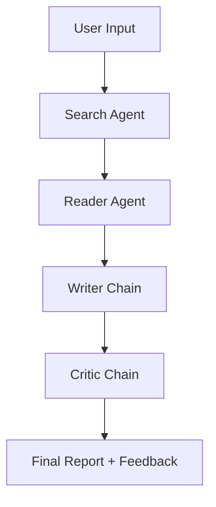

# 🧠 LangChain Multi-Agent Research System

An automated AI-powered research system that searches the web, analyzes sources, and writes comprehensive reports. Built with LangChain, Groq, and Streamlit.

---

## 🚀 Overview

The **AI Research Writer** is a multi-agent pipeline designed to automate the process of deep research. It leverages specialized agents to handle searching, reading, writing, and critiquing, ensuring high-quality and factual outputs.

### Key Features
- **Automated Web Search**: Uses Tavily API to find the most relevant and up-to-date sources.
- **Content Scraping**: Specialized reader agent to extract deep content from selected URLs.
- **Structured Reporting**: Automatically generates reports with an introduction, key findings, and conclusion.
- **AI Critique**: A built-in critic reviews the report for quality and suggests improvements.
- **User-Friendly UI**: Responsive Streamlit interface for seamless interaction.

---

## 🏗️ Architecture

The system follows a sequential pipeline architecture involving multiple specialized agents and chains:

1.  **Search Agent**: Queries the web using the Tavily Search tool to gather initial snippets and URLs.
2.  **Reader Agent**: Parses the search results, identifies the most relevant source, and scrapes the full text content.
3.  **Writer Chain**: Processes both the search snippets and the detailed scraped content to draft a structured Markdown report.
4.  **Critic Chain**: Evaluates the drafted report against quality standards, providing a score and constructive feedback.



---

## 🛠️ Technologies Used

- **LLM**: [Groq](https://groq.com/) (using high-speed LPU inference)
- **Framework**: [LangChain](https://www.langchain.com/)
- **Search API**: [Tavily AI](https://tavily.com/)
- **UI**: [Streamlit](https://streamlit.io/)
- **Scraping**: BeautifulSoup4 & Requests
- **Environment**: Python 3.11+

---

## ⚙️ Installation & Setup

### 1. Prerequisites
- [Conda](https://docs.conda.io/projects/conda/en/latest/user-guide/install/index.html) (recommended) or Python 3.11+
- API Keys for **Groq** and **Tavily**

### 2. Clone the Repository
```bash
git clone https://github.com/your-username/Langchain-Multi-Agent-Research-System.git
cd Langchain-Multi-Agent-Research-System
```

### 3. Environment Setup
```bash
# Create and activate a new conda environment
conda create -n langagent python=3.11 -y
conda activate langagent

# Install dependencies
pip install -r requirements.txt
```

### 4. Configuration
Create a `.env` file in the root directory and add your API keys:
```env
GROQ_API_KEY=your_groq_api_key_here
TAVILY_API_KEY=your_tavily_api_key_here
```

---

## 🏃 Usage

### Run via Streamlit (Web UI)
```bash
streamlit run app.py
```

### Run via CLI
```bash
python main.py
```

---

## 📂 Project Structure
- `app.py`: Streamlit web interface.
- `main.py`: CLI entry point.
- `src/agents/`: Agent and Chain definitions.
- `src/tools/`: Custom search and scraping tools.
- `src/pipeline/`: Orchestration logic for the research process.

---

## 📄 License
This project is licensed under the MIT License - see the [LICENSE](LICENSE) file for details.